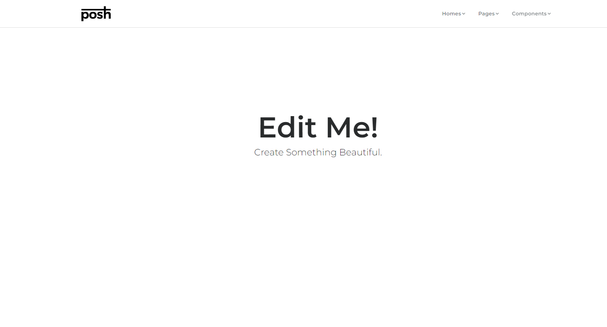
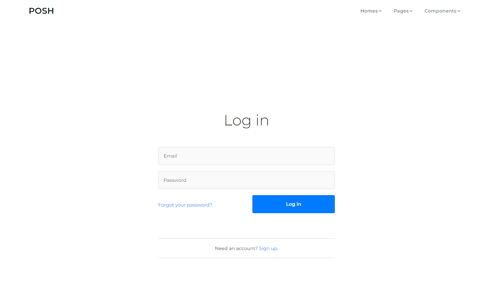
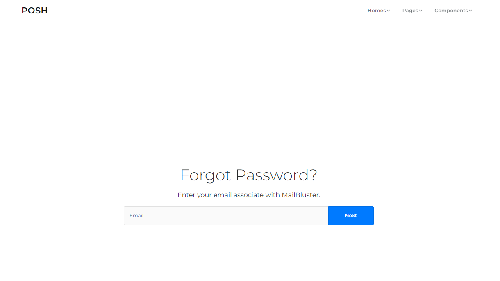
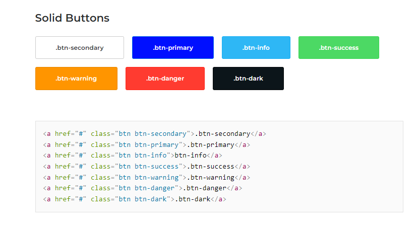

# Site Theme

LMS site to be based on **Posh - Starter Page** (https://prium.github.io/tryposh/page-starter.html)
- Posh original style.css (https://prium.github.io/tryposh/assets/css/style.css)
- No CDN's. All JS, CSS are to stored localy on the server.
- Update jQuery version to 3.5.1 (https://code.jquery.com/jquery-3.5.1.slim.min.js)
- HTML 5
- Bootstrap 4.6.x



#### Supported Browsers

- Chrome
- Edge
- Firefox
- Mobile
- Opera
- Safari

# Pages

#### Login

Login Simple.. (https://prium.github.io/tryposh/page-log-in.html)



#### Password Recovery

Forgot Password (https://prium.github.io/tryposh/page-recovery.html)



# Grid System

Bootstrap 4 grid.. (https://getbootstrap.com/docs/4.0/layout/grid/)

# Layout Helpers

Support for 25%, 50%, 75%, and 100% by default... (https://prium.github.io/tryposh/component-layout-helpers.html)

# Icons

Font Awesome. https://fontawesome.com/icons/

<i class="fa-light fa-wave-pulse"></i> - Pulse (dashboard icon)<br>
<i class="fa-light fa-columns"></i> - Columns<br>
<i class="fa-light fa-circle-xmark"></i> - Exit<br>
<i class="fa-light fa-file-pdf"></i> - PDF<br>
<i class="fa-light fa-file-csv"></i> - CSV<br>
<i class="fa-light fa-file-spreadsheet"></i> - Excel<br>
<i class="fa-light fa-cloud-arrow-up"></i> - File Upload<br>
<i class="fa-light fa-exclamation-circle"></i> - Exclamation<br>
<i class="fa-light fa-eye"></i> - Eye<br>
<i class="fa-light fa-eye-slash"></i> - Eye Slash<br>
<i class="fa-solid fa-lock"></i> - Lock Fill<br>
<i class="fa-light fa-unlock"></i> - Unlock File<br>
<i class="fa-solid fa-unlock"></i> - Unlock File<br>
<i class="fa-solid fa-lock-open"></i> - Unloack<br>
<i class="fa-light fa-sync"></i>- Refresh<br>
<i class="fa-light fa-arrow-rotate-left"></i> - Undo<br>
<i class="fa-light fa-calendar-clock"></i> - Calendar/Task<br>
<i class="fa-light fa-trash"></i> - Trash<br>
<i class="fa-light fa-envelope"></i> - Envelope<br>
<i class="fa-light fa-user"></i> - User/Person<br>
<i class="fa-light fa-users"></i> - - Users/People<br>
<i class="fa-light fa-print"></i> - Print<br>
<i class="fa-light fa-question-circle"></i> - Question<br>
<i class="fa-light fa-reply"></i> - Reply<br>
<i class="fa-light fa-reply-all"></i> - Reply All<br>
<i class="fa-light fa-search"></i> - Search<br>
<i class="fa-light fa-send"></i> - Send<br>
<i class="fa-light fa-sort-alpha-down"></i> - Sort<br>
<i class="fa-light fa-sort-alpha-up"></i> - Sort<br>
<i class="fa-light fa-sort-down"></i> - Sort<br>
<i class="fa-light fa-sort-up"></i> - Sort<br>
<i class="fa-light fa-sort-numeric-down"></i> - Sort<br>
<i class="fa-light fa-sort-numeric-up"></i> - Sort<br>
<i class="fa-solid fa-star"></i> - Favorite<br>
<i class="fa-light fa-star"></i> - Favorite<br>
<i class="fa-light fa-notes"></i> - Notes<br>
<i class="fa-light fa-ellipsis-stroke"></i> - Action Menu<br>
<i class="fa-light fa-files"></i> - Clone<br>
<i class="fa-light fa-file-circle-plus"></i> - New Version<br>

# Dropdown

Semantic UI dropdown.. (https://prium.github.io/tryposh/component-dropdowns.html)


#### HTML
```
<div class="ui selection dropdown">
	<input type="hidden"/>
	<i class="dropdown icon"></i>
	<div class="text">Dropdown Menu</div>
	<div class="menu">
		<div class="item">All Categories</div>
		<div class="item">Digital</div>
		<div class="item">Animation</div>
		<div class="item">Print</div>
	</div>
</div>
```

#### JavaScript
```
<script src="assets/lib/semantic-ui-dropdown/dropdown.js"></script>
<script src="assets/lib/semantic-ui-transition/transition.js"></script>
```

#### CSS
```
<link href="assets/lib/semantic-ui-dropdown/dropdown.css" rel="stylesheet"/>
<link href="assets/lib/semantic-ui-transition/transition.css" rel="stylesheet"/>
```

# Alerts

Boostrap 4 Alerts (https://prium.github.io/tryposh/component-alerts.html)
```
<div class="alert alert-success" role="alert">
	<button class="close" type="button" data-dismiss="alert" aria-label="Close">
		<span aria-hidden="true">×</span>
	</button>
	<strong>Well done!</strong> You successfully read 
	<a class="alert-link" href="#">this important alert message</a>.</div>
<div class="alert alert-info" role="alert">
	<button class="close" type="button" data-dismiss="alert" aria-label="Close">
		<span aria-hidden="true">×</span>
	</button>
	<strong>Heads up!</strong> This 
	<a class="alert-link" href="#">alert needs your attention</a>, but it's not super important.</div>
<div class="alert alert-warning" role="alert">
	<button class="close" type="button" data-dismiss="alert" aria-label="Close">
		<span aria-hidden="true">×</span>
	</button>
	<strong>Warning!</strong> Better check yourself, you're 
	<a class="alert-link" href="#">not looking too good</a>.</div>
<div class="alert alert-danger" role="alert">
	<button class="close" type="button" data-dismiss="alert" aria-label="Close">
		<span aria-hidden="true">×</span>
	</button>
	<strong>Oh snap!</strong>
	<a class="alert-link" href="#">Change a few things up</a> and try submitting again.</div>
```

# Badges

Contextual badges (https://prium.github.io/tryposh/component-badge.html)

```
<span class="badge badge-default">Default</span>

```
```
<span class="badge badge-primary">Primary</span>
<span class="badge badge-secondary">Secondary</span>
<span class="badge badge-success">Success</span>
<span class="badge badge-danger">Danger</span>
<span class="badge badge-warning">Warning</span>
<span class="badge badge-info">Info</span>
<span class="badge badge-light">Light</span>
<span class="badge badge-dark">Dark</span>
```

# Buttons

Posh use .btn class for default button style. Customize the color of a button using .btn-* and .btn-outline-*. You can use the following classes. (https://prium.github.io/tryposh/component-buttons.html)




```
<a href="#" class="btn btn-secondary">.btn-secondary</a>
<a href="#" class="btn btn-primary">.btn-primary</a>
<a href="#" class="btn btn-info">btn-info</a>
<a href="#" class="btn btn-success">.btn-success</a>
<a href="#" class="btn btn-warning">.btn-warning</a>
<a href="#" class="btn btn-danger">.btn-danger</a>
<a href="#" class="btn btn-dark">.btn-dark</a>
```

# Colors

Posh Colors (https://prium.github.io/tryposh/component-colors.html)

```#0000ff``` ```.color-primary .background-primary```<br>
```#2EB7F5``` ```.color-info .background-info```


